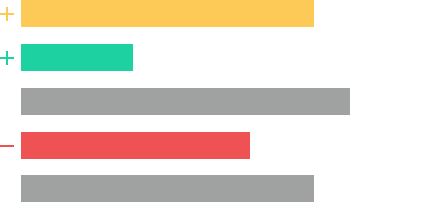
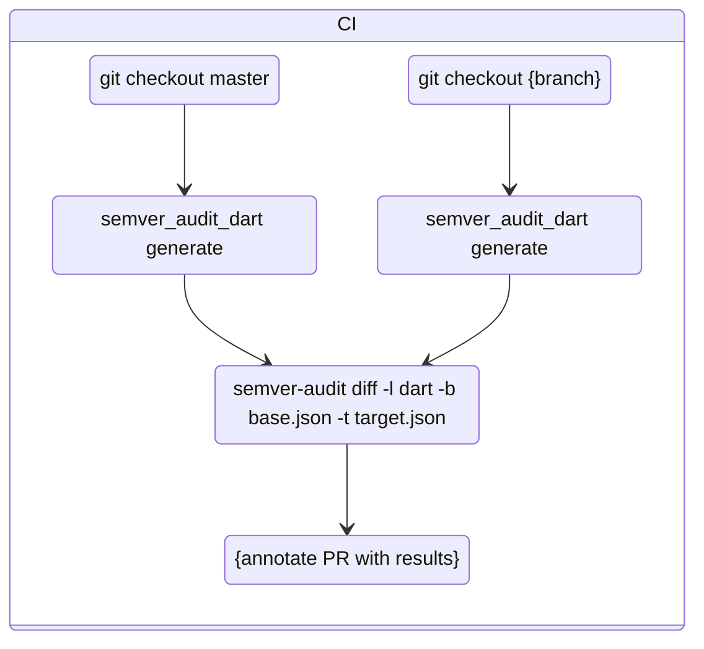

An ecosystem of command line tools to assist in automatically assigning a [semver](https://semver.org/) recommendation based on changes in the public api. 

Designed to be executed in CI, semver-audit makes knowledge about the public api a key part of code reviews, ultimately resulting in less unknown breaking changes for consumers.

## Usage

Semver audit currently supports 3 languages: [dart](/indexers/dart/README.md), [typescript](/indexers/typescript/README.md), and [go](/indexers/go/README.md). Running the tool involves indexing your codebase to parse the public api, and diffing that using the semver-audit diff cli. The following example is for a typescript package

```console
$ git checkout master
$ npx @workiva/semver-audit-typescript generate ./ > master.json

$ git checkout feature_branch
$ npx @workiva/semver-audit-typescript generate ./ > my_branch.json

$ npx @workiva/semver-audit --base ./master.json --target ./my_branch.json
```

## Usage in CI

While semver audit can be executed locally, its designed to be ran within CI, posting results on a pull request. An example configuration for this looks like the following

> [!NOTE]
> Workiva employees, please refer to the pre-configured [gha-semver-audit](https://github.com/Workiva/gha-semver-audit) workflows for easier execution

```yaml
jobs:
  semver-audit:
    runs-on: [xs-al2023]
    steps:
      - uses: dart-lang/setup-dart@v1
      - uses: actions/setup-node@v6

      - run: mkdir ../semver_audit

      # -- Index Base ------------------------------------------------------------
      - uses: actions/checkout@v5
        with:
          ref: ${{ github.event.pull_request.base.ref }}
      - run: |
          dart pub get
          dart pub global run semver_audit generate > ../semver_audit/base.json

      # -- Index Target ----------------------------------------------------------
      - uses: actions/checkout@v5
      - run: |
          dart pub get
          dart pub global run semver_audit generate > ../semver_audit/target.json

      # -- Diff Reports ---------------------------------------------------------
      - id: diff
        run: |
          DIFF=$(
            npx @workiva/semver-audit \
              --format='markdown' \
              --base='../semver_audit/base.json' \
              --target='../semver_audit/target.json'
          )
          echo "res=$DIFF" >> $GITHUB_OUTPUT

      # Post a comment on the PR with the diff results
      - uses: peter-evans/create-or-update-comment@v5
        with:
          issue-number: ${{ github.event.pull_request.number }}
          body: |
            # Semver Audit Output

            ${{ steps.execute-diff.outputs.res }}
```

# Development

See [CONTRIBUTING.md](/CONTRIBUTING.md) for documentation on how to setup the repo, run unit tests, and high level architecture

The semver-audit ecosystem can be split into 3 different parts:

- indexers: command line applications which output the public api of a package. 
  - Written in the language they are indexing, so they can leverage existing ast/analysis tools. 
  - Reside within the [indexers/](indexers/) folder
- semver-audit cli ([`src/`](src/)): aggregates reports generated by indexers, executes plugins correlating to the provided reports, and generates a diff output
- semver-audit plugins ([`src/plugins`](src/plugins/)): logic specific to the indexed language which evaluates the semver label associated with each change in the public api



test 123

For an overview of indexer development, please read [doc/indexer-architecture.md](/doc/indexer-architecture.md). For more information about plugins and how to build your own, please read [doc/plugin-architecture.md](/doc/plugin-architecture.md). Before making a PR, also please read [CONTRIBUTING.md](/CONTRIBUTING.md)

