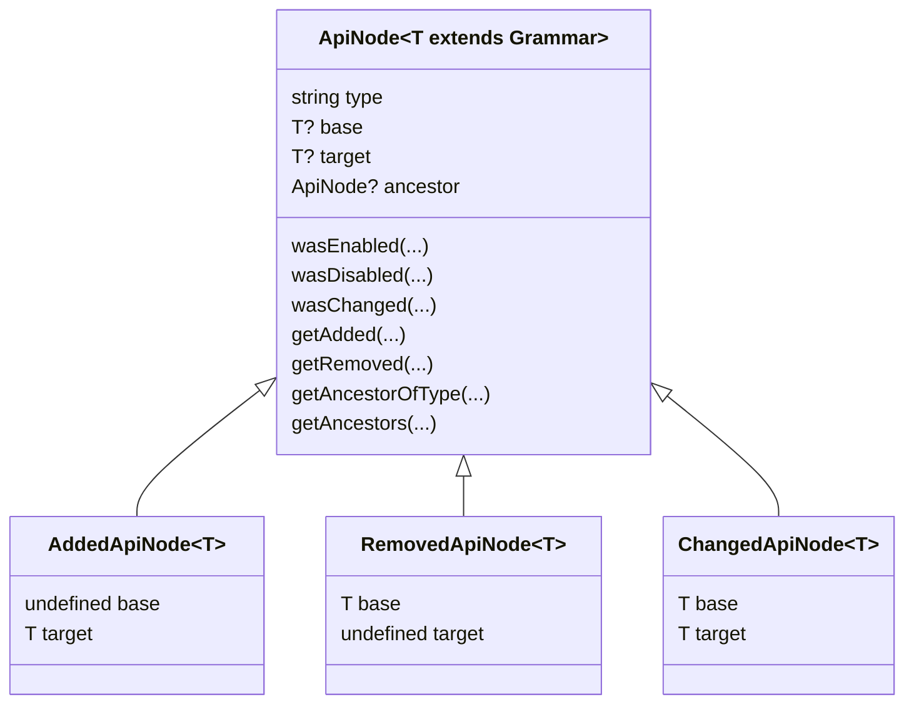

## Plugin Architecture

> [!NOTE]
> The following is specific documentation about semver-audit plugins. For an overview of semver-audit as a whole, please see [README.md](/README.md#development)


Semver audit plugins are responsible for the language specific logic that goes into determining the semver justification for a change. They are written in typescript, live within the semver-audit repo, and adhere to the `SemverAuditPlugin` interface. 

Each plugin should have a correlating "justification" document in `docs/plugins/{language}.md`. This document functions as the "source of truth" for what the plugin considers a major, minor or patch change.

A basic implementation is as follows:

```ts
export default class ExamplePlugin extends SemverAuditPlugin {
    /** 
     * Whether or not this plugin should execute. 
     * [language] is the value passed into the cli using the --language flag
     */
    override shouldExecute(language: string): boolean {
        return language = 'example-lang';
    }

    /** 
     * Called when semver-audit finds a node that was not in [base], but was in [target]
     * implying that this node was added
     */
    override onAdd(node: AddedApiNode<ExampleGrammar>): Semver[] {}

    /** 
     * Called when semver-audit finds a node that was in [base], but was not in [target]
     * implying that this node was removed
     */
    override onRemove(node: RemovedApiNode<ExampleGrammar>): Semver[] {}
    
    /** 
     * Called when semver-audit finds a node that was in both [base] and [target]
     */
    override onChange(node: ChangedApiNode<ExampleGrammar>): Semver[] {}
}
```

Each of the node classes `AddedApiNode`, `RemovedApiNode` and `ChangedApiNode` inherit from a super class `ApiNode` which provides utility methods for checking grammar changes. Each respective child class asserts nullability based on the triggering action, meaning `RemovedApiNode` declares a non-null `base` grammar, and a `undefined` target. For more information about how to use each method, please refer to the in-code documentation comments



### Grammar

In accordance with the semver-audit indexer output, each node contains a `grammar` field describing additional metadata about each public api entry

```json
{
    "ent/Foo": {
        "type": "class",
        "grammar": {
            "name": "Foo",
            "extends": ["Bar"],
            "is_abstract": false
        }
    }
}
```

In the plugin interfaces, there is a `Grammar` type which represents this object.

It is expected that each plugin implements their own interfaces for this grammar object, so typing is applied within the plugin logic

```typescript

interface ExampleGrammar extends Grammar {
    // top level "ExampleGrammar" implementation, put things here that will apply to _every_ node
    // in the example language output
    annotations: string[]
}

interface ClassExampleGrammar extends ExampleGrammar {
    name: string
    extends: string[]
    is_abstract: boolean
}
```

In the plugins `onAdd`, `onRemove`, and `onChange`, you can cast the ApiNode to its respective grammar types:

```typescript
function onChange(node: AddedApiNode<ExampleGrammar>) {
    switch (node.type) {
        case "class": onClassChange(node as ChangedApiNode<ClassExampleGrammar>)
    }
}
```

### Ancestors

The semver-audit report specification declares node ancestry with the `parent_key` field

```dart
// entrypoint.dart

class Foo {
    void bar() {}
}
```

```json
{
    "ent": {
        "type": "entrypoint",
        "key": "ent",
        "parent_key": null
    },
    "ent/Foo": {
        "type": "class",
        "key": "ent/Foo",
        "parent_key": "ent"
    },
    "ent/Foo/bar": {
        "type": "method",
        "key": "ent/Foo/bar",
        "parent_key": "ent/Foo"
    }
}
```

Ancestors can be traversed using the `getAncestorOfType` and `getAncestors` functions on `ApiNode`

```typescript
function onAdd(node: AddedApiNode<ExampleGrammar>): Semver[] {
    if (node.type == "method") {
        let parentClass = node.getAncestorOfType<ClassExampleGrammar>("class")
        if (parentClass.target.is_abstract) {
            // do something special since the class is abstract
        }
    }
}
```

